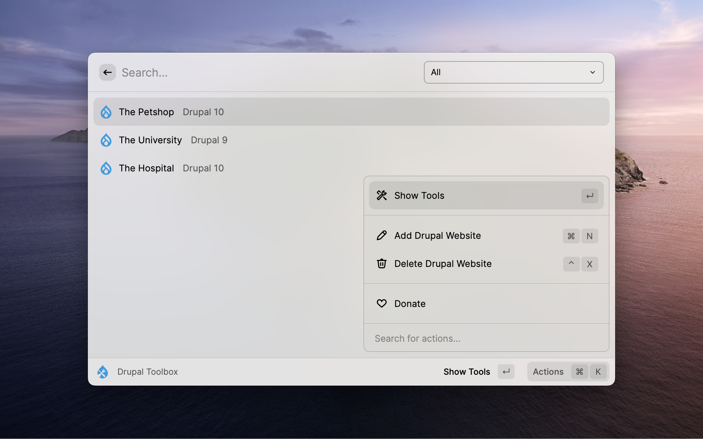
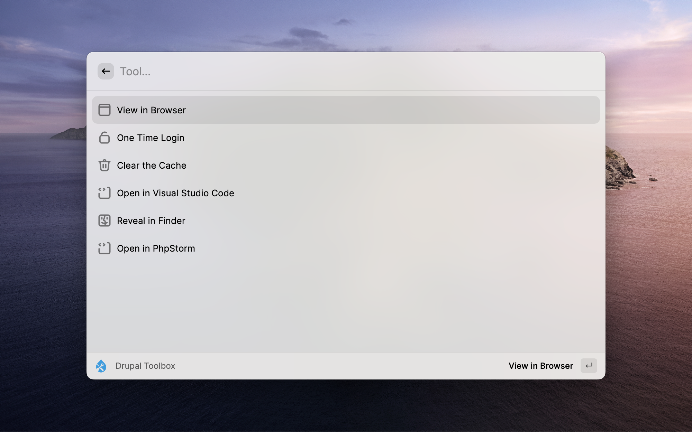
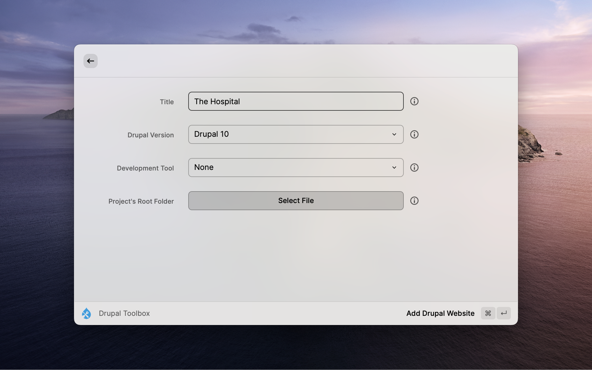
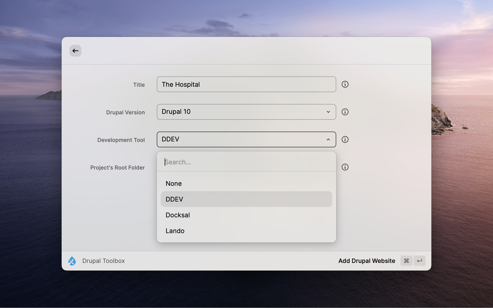

# Drupal Toolbox 

Valuable tools and shortcuts for your Drupal Websites.

Manage your Drupal Websites with ease.

 

| | |
| ----------- | ----------- |
| | |

## Available Tools

* View In Browser
* Clear the Cache
* Reveal In Finder
* One Time Login
* Open In Visual Studio Code
* Open In PhpStorm

## Plans

- Add More Tools
- Support SSH Connections
- Support Multisite Drupal Website
- Add Tool Groups
    - Install Modules
        - Install and Enable Admin Toolbar
        - Install and Enable Webform
        - Install and Enable [****]
    - Generate
        - Controller
        - [****]

## Changelog

### [Initial Version] - 2022-11-25

- Implement CR*D for Drupal Website records
- Develop a sorting system based on last open date
- Add the most used tools
- Design the logos

> **Contribute:** Feel free to Fork and Create PR, whether in this repo or Raycast's Extension [repo](https://github.com/raycast/extensions/tree/main/extensions/drupal-toolbox)
